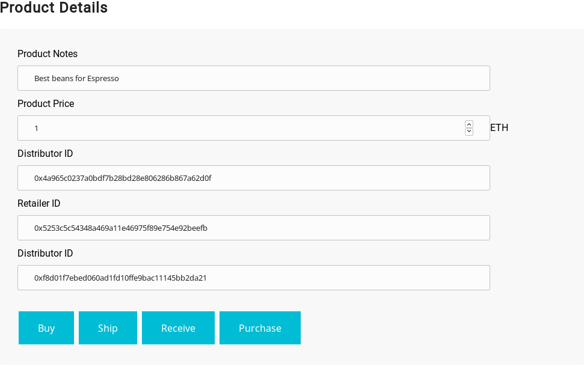

# Project6B
Architect a Blockchain Supply Chain Solution - Part B

## Getting Started

These instructions will install requirements and allow you to execute the code.

### Prerequisites

Installing Node and NPM is pretty straightforward using the installer package available from the (Node.js® web site)[https://nodejs.org/en/]. Most Linux distributions have ready-to-install packages.

### Configuring your project


- Install requirements (within project6 folder)
```
npm install 
```

You also need ganache-cli and truffle (not v5).

- To test the contract issue the command ```truffle test test/TestSupplychain.js```.
All tests should pass.
``` 
$>truffle test test/TestSupplychain.js 
Using network 'development'.

ganache-cli accounts used here...
Contract Owner: accounts[0]  0x27d8d15cbc94527cadf5ec14b69519ae23288b95
Farmer: accounts[1]  0x018c2dabef4904ecbd7118350a0c54dbeae3549a
Distributor: accounts[2]  0xce5144391b4ab80668965f2cc4f2cc102380ef0a
Retailer: accounts[3]  0x460c31107dd048e34971e57da2f99f659add4f02
Consumer: accounts[4]  0xd37b7b8c62be2fdde8daa9816483aebdbd356088


  Contract: SupplyChain
    ✓ Testing smart contract function harvestItem() that allows a farmer to harvest coffee (176ms)
    ✓ Testing smart contract function processItem() that allows a farmer to process coffee (92ms)
    ✓ Testing smart contract function packItem() that allows a farmer to pack coffee (85ms)
    ✓ Testing smart contract function sellItem() that allows a farmer to sell coffee (80ms)
    ✓ Testing smart contract function buyItem() that allows a distributor to buy coffee (88ms)
    ✓ Testing smart contract function shipItem() that allows a distributor to ship coffee (78ms)
    ✓ Testing smart contract function receiveItem() that allows a retailer to mark coffee received (84ms)
    ✓ Testing smart contract function purchaseItem() that allows a consumer to purchase coffee (86ms)
    ✓ Testing smart contract function fetchItemBufferOne() that allows anyone to fetch item details from blockchain
    ✓ Testing smart contract function fetchItemBufferTwo() that allows anyone to fetch item details from blockchain


  10 passing (870ms)

```
- Install Metamask plugin for chrome or firefox

- Metascan must be connected to your wallet. Your need to add ether to your wallet from a faucet.
- When your web app interacts with your wallet, Metascan will ask for confirmation.

- To start the application issue the command  ```npm run dev```. The UI will look like below:
### Farm details

### Product details


## Contract deployment
```
truffle migrate --network rinkeby --reset --compile-all 
Compiling ./contracts/Migrations.sol...
Compiling ./contracts/coffeeaccesscontrol/ConsumerRole.sol...
Compiling ./contracts/coffeeaccesscontrol/DistributorRole.sol...
Compiling ./contracts/coffeeaccesscontrol/FarmerRole.sol...
Compiling ./contracts/coffeeaccesscontrol/RetailerRole.sol...
Compiling ./contracts/coffeeaccesscontrol/Roles.sol...
Compiling ./contracts/coffeebase/SupplyChain.sol...
Compiling ./contracts/coffeecore/Ownable.sol...

Writing artifacts to ./build/contracts

Using network 'rinkeby'.

Running migration: 1_initial_migration.js
  Deploying Migrations...
  ... 0x14b920480f61fabad621d65627459a9fe4755cfa230738ffabac57c73654b55a
  Migrations: 0xc0ae9dc1b7bca694ccd6c8edda91ce0c1996a049
Saving successful migration to network...
  ... 0xf913a521fd29366abe98719060f26503b969d34fe4b6f6a66c36ff111153680d
Saving artifacts...
Running migration: 2_deploy_contracts.js
  Deploying FarmerRole...
  ... 0xb63d06a3c7372224af0705b8c82f7ba86559618709e7a50f4b743ae2c2af209e
  FarmerRole: 0x7b801a4fcbc504ca989cc2c0aa3dc1996996c183
  Deploying DistributorRole...
  ... 0x558288f0a9c9a1f29dbf2b579e8fe74077eac3766c86ec668133f008145a8dde
  DistributorRole: 0x017ef6a2c2b9a25c9727dae37fed14aa30fa727b
  Deploying RetailerRole...
  ... 0x3f09042df1a8f8dcc0bd50bcf060f094ce86438c768ef803800e8a30569ed1dd
  RetailerRole: 0xacc754f3208c5dd23d3c90905417bd378cd0c8ec
  Deploying ConsumerRole...
  ... 0xdc8252b002cb6a7550654b49224213354f4520d27649c2b3700ec2ce38040bba
  ConsumerRole: 0x4d8d61d1d6f5463e0795aa26b949f5f172e3a827
  Deploying SupplyChain...
  ... 0xa30c3b0a80ecc813a6ca71ce27bbd13360284186aa2e4c6fa1145743b7fb0dca
  SupplyChain: 0xdad7a31af24fc5700043d27f108bd5093e7ad8a7
Saving successful migration to network...
  ... 0xe0acfaa1e4d95e0a02c9adaa9062fe7bbdedad35320025b586c205a2a42b41f2
Saving artifacts...
```
## View details on Etherscan
### Contract address 
https://rinkeby.etherscan.io/address/0xdad7a31af24fc5700043d27f108bd5093e7ad8a7

### Transaction information
```
TxHash:0xa30c3b0a80ecc813a6ca71ce27bbd13360284186aa2e4c6fa1145743b7fb0dca 
TxReceipt Status:Success
```
https://rinkeby.etherscan.io/tx/0xa30c3b0a80ecc813a6ca71ce27bbd13360284186aa2e4c6fa1145743b7fb0dca


#### Harvest transaction
```
TxHash:0xd7070b323da8314b086e96f2886ae6a1837415861a3709ddcbd3da835fdd0344 
TxReceipt Status:Success
```
https://rinkeby.etherscan.io/tx/0xd7070b323da8314b086e96f2886ae6a1837415861a3709ddcbd3da835fdd0344

#### Process transaction
```
TxHash:0x65608c8347e224783b1dd073fe0436f9c22947c6ba982e45904c3c6af63a7251 
TxReceipt Status:Success
```
https://rinkeby.etherscan.io/tx/0x65608c8347e224783b1dd073fe0436f9c22947c6ba982e45904c3c6af63a7251

#### Pack transaction
```
TxHash:0x120793762106fe6b9e0256dc16ce53274d4dcf5f9c3f8097bdf2ea541abc0ead 
TxReceipt Status:Success
```
https://rinkeby.etherscan.io/tx/0x120793762106fe6b9e0256dc16ce53274d4dcf5f9c3f8097bdf2ea541abc0ead

#### ForSale transaction
```
TxHash:0x8fd7d1e517301bde0de070affe2850f7439df2e649b39ae28f003cd1ba1720eb 
TxReceipt Status:Success
```
https://rinkeby.etherscan.io/tx/0x8fd7d1e517301bde0de070affe2850f7439df2e649b39ae28f003cd1ba1720eb

#### Sold transaction
```
TxHash:0x807791083401999a7df45791b0cbc39ffd8f03c22336834235cd4576655c0c83 
TxReceipt Status:Success
```
https://rinkeby.etherscan.io/tx/0x807791083401999a7df45791b0cbc39ffd8f03c22336834235cd4576655c0c83

#### Shipped transaction
```
TxHash:0x73c9872bb0db4ff49840a131e30df6566bd8755cbe26d58d7a03d24deb02f398 
TxReceipt Status:Success
```
https://rinkeby.etherscan.io/tx/0x73c9872bb0db4ff49840a131e30df6566bd8755cbe26d58d7a03d24deb02f398

#### Received transaction
```
TxHash:0x8bfd0a18d156961d58a0196ce0e963edffc7983c45ced41246bc0be4c47bf25c 
TxReceipt Status:Success
```
https://rinkeby.etherscan.io/tx/0x8bfd0a18d156961d58a0196ce0e963edffc7983c45ced41246bc0be4c47bf25c

#### Purchased transaction
```
TxHash:0xa75b4f3754f8e7241be24c4d417e19ebbf2d1653d09901b6160226017f8d9eda 
TxReceipt Status:Success
```
https://rinkeby.etherscan.io/tx/0xa75b4f3754f8e7241be24c4d417e19ebbf2d1653d09901b6160226017f8d9eda
    


## UML Diagrams

### Activity Diagram


### Sequence Diagram


### State Diagram


### Class Diagram (Data model)


 #### Attributions
 1. Deploying a Smart Contract in Rinkeby using Infura 
 https://walkingtree.tech/deploying-a-smart-contract-in-rinkeby-using-infura/
 