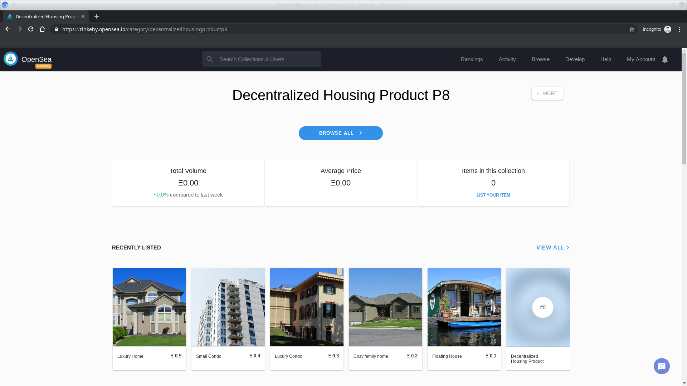

# Project8 (Blockchain Capstone project)
The capstone will build upon the knowledge you have gained in the course in order to build a decentralized housing product.


Project rubric https://review.udacity.com/#!/rubrics/1712/view

Using:
- Truffle v5.0.10 (core: 5.0.10)
- Solidity v0.5.0 (solc-js)
- Node v10.15.3
- Web3.js v1.0.0-beta.37

## Getting Started

These instructions will install requirements and allow you to execute the code.

### Prerequisites

Installing Node and NPM is straightforward using the installer package available from the (Node.js® web site)[https://nodejs.org/en/]. Most Linux distributions have ready-to-install packages.

### Configuring your project

- Install requirements
```
npm install 
```
- start ganache-cli with the following command:
```
ganache-cli
```
- Compile your project and migrate it
```
truffle migrate --reset --compile-all
```
- Test you contracts using the command ```truffle test``` withing ```eth-contracts``` folder. 
Expected output is as follows:
``` 
Contract: TestERC721Mintable
    have ownership properties
      ✓ should fail when minting when address is not contract owner (4837ms)
      ✓ should return contract owner
      ✓ Verify correct handling of ownership transfer (130ms)
    check correct approval handling
      ✓ verify approval for 1 token (61ms)
      ✓ verify approval for all tokens (114ms)
    match erc721 spec
      ✓ should return total supply
      ✓ should get token balance
      ✓ should return token uri
      ✓ should transfer token from one owner to another (168ms)

  Contract: SolnSquareVerifier
    check approvals
      ✓ ERC721 token can be minted for contract (2357ms)
      ✓ new solution can be added for contract - disallow duplicates  (6761ms)

  Contract: SquareVerifier
    verification with correct and incorrect proof
      ✓ test verify correct proof (2223ms)
      ✓ test verify wrong proof (412ms)


  13 passing (1m)
```

You can run each test file separetely using the following commands:
```
truffle test test/TestERC721Mintable.js
truffle test test/TestSquareVerifier.js 
truffle test test/TestSolnSquareVerifier.js 
```

### Rinkeby deployment

- To migrate to Rinkeby:
```
 truffle migrate --network rinkeby --reset --compile-all 

Compiling your contracts...
===========================
> Compiling ./contracts/ERC721Mintable.sol
> Compiling ./contracts/Migrations.sol
> Compiling ./contracts/Oraclize.sol
> Compiling ./contracts/SolnSquareVerifier.sol
> Compiling ./contracts/Verifier.sol
> Compiling openzeppelin-solidity/contracts/drafts/Counters.sol
> Compiling openzeppelin-solidity/contracts/math/SafeMath.sol
> Compiling openzeppelin-solidity/contracts/token/ERC721/IERC721Receiver.sol
> Compiling openzeppelin-solidity/contracts/utils/Address.sol
> Artifacts written to /home/evelthon/Documents/Nanodegree_Blockchain/P8_Capstone/eth-contracts/build/contracts
> Compiled successfully using:
   - solc: 0.5.2+commit.1df8f40c.Emscripten.clang


Migrations dry-run (simulation)
===============================
> Network name:    'rinkeby-fork'
> Network id:      4
> Block gas limit: 0x6e38b1


1_initial_migration.js
======================

   Deploying 'Migrations'
   ----------------------
   > account:             0x60CEf8b8EE80C5E5220e8E9A472EFF0ce86C81E2
   > balance:             12.709378009000000002
   > gas used:            258162
   > gas price:           10 gwei
   > value sent:          0 ETH
   > total cost:          0.00258162 ETH

   -------------------------------------
   > Total cost:          0.00258162 ETH


2_deploy_contracts.js
=====================

   Deploying 'SquareVerifier'
   --------------------------
   > account:             0x60CEf8b8EE80C5E5220e8E9A472EFF0ce86C81E2
   > balance:             12.691366309000000002
   > gas used:            1774142
   > gas price:           10 gwei
   > value sent:          0 ETH
   > total cost:          0.01774142 ETH


   Deploying 'SolnSquareVerifier'
   ------------------------------
   > account:             0x60CEf8b8EE80C5E5220e8E9A472EFF0ce86C81E2
   > balance:             12.649473779000000002
   > gas used:            4189253
   > gas price:           10 gwei
   > value sent:          0 ETH
   > total cost:          0.04189253 ETH

   -------------------------------------
   > Total cost:          0.05963395 ETH


Summary
=======
> Total deployments:   3
> Final cost:          0.06221557 ETH


Starting migrations...
======================
> Network name:    'rinkeby'
> Network id:      4
> Block gas limit: 0x6e4027


1_initial_migration.js
======================

   Deploying 'Migrations'
   ----------------------
   > Blocks: 0            Seconds: 8   > transaction hash:    0x61f26b63aadf539d9242b2b3c89ecff38dea91b3713133daf5c01fc2dc341030

   > contract address:    0xBfD410FA631A14593D5d92D4f11ce93b9714f2a4
   > account:             0x60CEf8b8EE80C5E5220e8E9A472EFF0ce86C81E2
   > balance:             12.709228009000000002
   > gas used:            273162
   > gas price:           10 gwei
   > value sent:          0 ETH
   > total cost:          0.00273162 ETH


   > Saving migration to chain.
   > Saving artifacts
   -------------------------------------
   > Total cost:          0.00273162 ETH


2_deploy_contracts.js
=====================

   Deploying 'SquareVerifier'
   --------------------------
   > transaction hash:    0xf558e9bccd5dbe83b210e56e478868c79db63ab9a342f5d9bb955bfab157037d
   > Blocks: 0            Seconds: 8
   > contract address:    0x9Ff03C04912048cdaF473b93fD874bBCB51A35Ca
   > account:             0x60CEf8b8EE80C5E5220e8E9A472EFF0ce86C81E2
   > balance:             12.691066309000000002
   > gas used:            1774142
   > gas price:           10 gwei
   > value sent:          0 ETH
   > total cost:          0.01774142 ETH


   Deploying 'SolnSquareVerifier'
   ------------------------------
   > transaction hash:    0xfd3baba02ebc2bf9be1cecc6a04695cc84b26a4a51b6d100408253b687c2e1a7
   > Blocks: 0            Seconds: 8
   > contract address:    0x3D3013274C6E0f365675E79FfBa245d7D8Bd039C
   > account:             0x60CEf8b8EE80C5E5220e8E9A472EFF0ce86C81E2
   > balance:             12.647571779000000002
   > gas used:            4349453
   > gas price:           10 gwei
   > value sent:          0 ETH
   > total cost:          0.04349453 ETH


   > Saving migration to chain.
   > Saving artifacts
   -------------------------------------
   > Total cost:          0.06123595 ETH


Summary
=======
> Total deployments:   3
> Final cost:          0.06396757 ETH

```

- To mint 10 tokens, issue the command ```node mint/mint.js``` within the project's root folder.

## View details on Etherscan
### SquareVerifier Contract address 
- https://rinkeby.etherscan.io/address/0x9Ff03C04912048cdaF473b93fD874bBCB51A35Ca
### Transaction information
```
TxHash:0xf558e9bccd5dbe83b210e56e478868c79db63ab9a342f5d9bb955bfab157037d 
TxReceipt Status:Success
```
https://rinkeby.etherscan.io/tx/0xf558e9bccd5dbe83b210e56e478868c79db63ab9a342f5d9bb955bfab157037d


### SolnSquareVerifier Contract Address
- https://rinkeby.etherscan.io/address/0x3D3013274C6E0f365675E79FfBa245d7D8Bd039C

### Transaction information
```
TxHash:0xfd3baba02ebc2bf9be1cecc6a04695cc84b26a4a51b6d100408253b687c2e1a7 
TxReceipt Status:Success
```
https://rinkeby.etherscan.io/tx/0xfd3baba02ebc2bf9be1cecc6a04695cc84b26a4a51b6d100408253b687c2e1a7

### OpenSea Marketplace Storefront
``` 
https://rinkeby.opensea.io/category/decentralizedhousingproduct.
```


## ZoKrates proof generation (zk-SNARKs)


```
sudo docker run -v ~/Nanodegree_Blockchain/P8_Capstone:/home/zokrates/code -ti zokrates/zokrates:0.3.0 /bin/bash
```

zokrates@142640f881b4:~/code/zokrates/code/square$ ~/zokrates compile -i square.code
```
Compiling square.code
Compiled program:
def main(private _2,_3):                                                                                                                                                                                                                                                       
        _4 = (_2 * _2)                                                                                                                                                                                                                                                         
        _5 = (_4 - _3)                                                                                                                                                                                                                                                         
        # _6, _7 = Rust::ConditionEq(_5)                                                                                                                                                                                                                                       
        _6 == (_5 * _7)                                                                                                                                                                                                                                                        
        _8 = (1 - _6)                                                                                                                                                                                                                                                          
        0 == (_8 * _5)                                                                                                                                                                                                                                                         
        # _9 = Rust::Identity(_8)                                                                                                                                                                                                                                              
        _10 = (1 - _9)                                                                                                                                                                                                                                                         
        _11 = (_9 * 1)                                                                                                                                                                                                                                                         
        _12 = (_10 * 0)                                                                                                                                                                                                                                                        
        _13 = (_11 + _12)                                                                                                                                                                                                                                                      
        return _13                                                                                                                                                                                                                                                             
Compiled code written to 'out'                                                                                                                                                                                                                                                 
Human readable code to 'out.code'                                                                                                                                                                                                                                              
Number of constraints: 12        
```
zokrates@142640f881b4:~/code/zokrates/code/square$ ~/zokrates setup
```
Performing setup...                                                                                                                                                                                                                                                            
def main(private _2,_3):                                                                                                                                                                                                                                                       
        _4 = (_2 * _2)                                                                                                                                                                                                                                                         
        _5 = (_4 - _3)                                                                                                                                                                                                                                                         
        # _6, _7 = Rust::ConditionEq(_5)                                                                                                                                                                                                                                       
        _6 == (_5 * _7)                                                                                                                                                                                                                                                        
        _8 = (1 - _6)                                                                                                                                                                                                                                                          
        0 == (_8 * _5)                                                                                                                                                                                                                                                         
        # _9 = Rust::Identity(_8)                                                                                                                                                                                                                                              
        _10 = (1 - _9)
        _11 = (_9 * 1)
        _12 = (_10 * 0)
        _13 = (_11 + _12)
        return _13
num variables: 14
num constraints: 10
num inputs: 2
Swap is not beneficial, not performing
* QAP number of variables: 13
* QAP pre degree: 10
* QAP degree: 16
* QAP number of input variables: 2
* G1 window: 5
* G2 window: 1
* G1 elements in PK: 109
* Non-zero G1 elements in PK: 83
* G2 elements in PK: 15
* Non-zero G2 elements in PK: 5
* PK size in bits: 25438
* G1 elements in VK: 4
* G2 elements in VK: 5
* VK size in bits: 3948
        Verification key in Solidity compliant format:{
                vk.A = Pairing.G2Point([0x477796842da6d84ecf29e4edaa5bef83796241ad48d63a39bacd2d601bdf22c, 0x152b4c6d5f2f6359a8856f97da52bbc7264215b8ac93bdbaded286f9f6db0ee2], [0x1cf1c3d4b86f3f4390b8864d0c7f994f7c0d08911617ac0584813e4aa419387c, 0x226606b88248ff8a5fcc831418866b55e6e5a9aafc1af1c8bcaa3d7a3d43c543]);
                vk.B = Pairing.G1Point(0x19b5647d8bb0222f1d4d29f4ae53e245dc1ecc6fc242d46051f19c6a41a84fd0, 0x28429e7a443de600ba794afe1327363e681a26881e90fd8a0960268a598b3d0a);
                vk.C = Pairing.G2Point([0x1e8762f147488ea4a50e2aae3f059e0085506fd9ae41e35a5a28591d11083566, 0x1400fe6ce7c8a54fafc6e3bf17be42114611dbb7660d5de9289f17fbec67fee9], [0x19fa2f88381aee1a39c58965e66912313ce7754ac0ad446ee925aeb5de3dc581, 0x152f93bc83d93da05a7ac57b81149c1a9bab44ef82978e8a215d0e7d0974ed39]);
                vk.gamma = Pairing.G2Point([0x23c6a206623be389a8d2445857d8f1a5f554f7170c5578e5d8fd974892fbb7ad, 0x30a8b913f2e871a378424b732dccf08e5e4563f26d4815f01e609e824fba52f], [0x230d0d64cc886f475eb82435aac2069b6f16b31d84c293fe792af2deb0fa95e6, 0xbf7f0c0c0cef37a9b2729c18a014e567baac609d62c4550a40de2f13bb08f25]);
                vk.gammaBeta1 = Pairing.G1Point(0x8bee2b334c9dfefd1c488665629f0210e0ff28e5b2997580fdf907863367323, 0x13e6401c1ad6ebaf3374e6043e76503b0a49d51676c9d9ab6815777ac6190c00);
                vk.gammaBeta2 = Pairing.G2Point([0x29087040b41c5f2d77778fa2bfd8b0e14ec62e58962d6b0fe1c1f9f42ff5b8c, 0x1dba3a9fd68c34531d1680b8d83bacb8ea1b20013bbf17b37d8dc3add00662ab], [0x2bd22c7ed9f36dfa82510c681f9c7f6d6623a962665488c0f6ac6fea1919f89, 0xa580dd832a589c2f65ea8de79173c529dfa9fdf299569e14b29e904fc9265b0]);
                vk.Z = Pairing.G2Point([0x23b1110da8c53097b0131cc66b35ae6727c61901f4cede97e6eebd5ace37071d, 0x2686a30872a7a40a4f8c56abf9a15fe3d0539d659d2387945489cedabdf12c6], [0x1e00480d4219152e96f3f2020b2819ec34a38b0622317567597498c426a13b79, 0x2af21d625e6640b52f309605d51be3111c692bbc25cb6969a3d187d5d2542bbc]);
                vk.IC = new Pairing.G1Point[](3);
                vk.IC[0] = Pairing.G1Point(0x20d483fa087ae6a036a8016306bb4935ff252e7d41e583afdf5c484114ab61d5, 0x4b5162c05ffd8b8b11dea30053376c42db7e44fafa56cc66c0023fcb1f25d19);
                vk.IC[1] = Pairing.G1Point(0x22979adf2fbdc87fe74a819646cf09801e3bc39a8f8c877e8a7c75e597a2c5e0, 0x21b12a741cbf6ea7787eaaa25c201042a8e3d43260ad0c9af3d2d1d1c9bc6d5b);
                vk.IC[2] = Pairing.G1Point(0x300338dc44f403f9026b9b9b33924997bed1477bd567c68dd463866fd9d5a150, 0x299cd03542acc12d1ec036187a4400ed30d0d1c22ed793183342be57f6497426);
                }
setup successful: true
```
~zokrates@142640f881b4:~/code/zokrates/code/square$ ~/zokrates compute-witness -a 3 9
```
  Computing witness for:
  def main(private _2,_3):
           _4 = (_2 * _2)
           _5 = (_4 - _3)
           # _6, _7 = Rust::ConditionEq(_5)
           _6 == (_5 * _7)
           _8 = (1 - _6)
           0 == (_8 * _5)
           # _9 = Rust::Identity(_8)
           _10 = (1 - _9)
           _11 = (_9 * 1)
           _12 = (_10 * 0)
           _13 = (_11 + _12)
           return _13
   
   Witness: 
   
   ~out_0 1
   ```
~/zokrates generate-proof
```
Generating proof...
Using Witness: {"~out_0": 1, "_11": 1, "_3": 9, "~one": 1, "_6": 0, "_7": 1, "_8": 1, "_2": 3, "_4": 9, "_13": 1, "_10": 0, "_9": 1, "_12": 0, "_5": 0}
Public inputs: [1, 9, 1]
Private inputs: [3, 9, 0, 1, 0, 1, 0, 1, 1, 0, 1]
* Elements of w skipped: 3 (33.33%)
* Elements of w processed with special addition: 4 (44.44%)
* Elements of w remaining: 2 (22.22%)
* Elements of w skipped: 1 (33.33%)
* Elements of w processed with special addition: 1 (33.33%)
* Elements of w remaining: 1 (33.33%)
* Elements of w skipped: 4 (36.36%)
* Elements of w processed with special addition: 5 (45.45%)
* Elements of w remaining: 2 (18.18%)
* Elements of w skipped: 4 (30.77%)
* Elements of w processed with special addition: 6 (46.15%)
* Elements of w remaining: 3 (23.08%)
* G1 elements in proof: 7
* G2 elements in proof: 1
* Proof size in bits: 2294
Proof:
A = Pairing.G1Point(0x2b87e1cbd2ee48394d90b659b779d612a4c515b98e277fab5db9d4f79231a224, 0x1b084306a472d225fc35f13aa4ef2688d25b218eaac067dee53eb561f4c504f2);
A_p = Pairing.G1Point(0x163dc17303650f735e6ccbcef77192c536a70a1fd08d690343f4d6bc5c226728, 0xa55996fcad1f1149651709eeac5d52d04ad258b17da2f76cd5a1e94f083f34a);
B = Pairing.G2Point([0x4b7c0fb9fec2fa0cef684e30c7568b319787ddd91a619302357929a2a546424, 0x1b60189703dc87765ed1f9f7c2e1c459c63cb785f7059e13558044fb6f181630], [0x20aac4a73d6f58b0d0a145c1d948f4a685d95dbb42f2295fd330416609bcfd25, 0xdbedfdbca005ed5059739793105e62ed6fb633b5565998bb11a0e6d80a2e69a]);
B_p = Pairing.G1Point(0x3c269607d5b3e3749383dffb7e3b50523167964fb228a94c03246713f7b1bb4, 0xab43362ba802999314fd4068ac1ba580359ffb62a84d2025d1c8298656b1052);
C = Pairing.G1Point(0x105a4b80d12680f40078d24e6aa38eeaabcf6feab801569839ed5d39987abf13, 0x1becc02fab4c5dc77069f3f6a122f0719c2e66c0e2f6ddf9752f1845ec8f9982);
C_p = Pairing.G1Point(0x1ee09cd29ac8e3a2c6a70257c849b20387345de41375fba532d9d36e55fdfe5a, 0x2cf20ebd41a0fe4081dc780d0fd6837acb4d4d3109657f892a83f711f07ab003);
H = Pairing.G1Point(0x4701b44c88c330266438b3a675243df44030f49e8a4f039ac274102b78db00e, 0xb2765f30f31e239f1eadbfb3c69b714f99bf49744523dd8935bb6d379527221);
K = Pairing.G1Point(0x1c94207bba4323fa3c126c10e22fd8166ea0dac2cdd187689316ad82bc3a1cb8, 0x2e12b33922fcf4741cb3ecb338a02d2155131ff123a65030e4ef225c958dc821);
generate-proof successful: true
```

~/zokrates export-verifier
```
Exporting verifier...
Finished exporting verifier.
```


# Project Resources

* [Remix - Solidity IDE](https://remix.ethereum.org/)
* [Visual Studio Code](https://code.visualstudio.com/)
* [Truffle Framework](https://truffleframework.com/)
* [Ganache - One Click Blockchain](https://truffleframework.com/ganache)
* [Open Zeppelin ](https://openzeppelin.org/)
* [Interactive zero knowledge 3-colorability demonstration](http://web.mit.edu/~ezyang/Public/graph/svg.html)
* [Docker](https://docs.docker.com/install/)
* [ZoKrates](https://github.com/Zokrates/ZoKrates)


Attributions

- Deploying a Smart Contract in Rinkeby using Infura https://walkingtree.tech/deploying-a-smart-contract-in-rinkeby-using-infura/
- ZoKrates tutorial with Truffle https://medium.com/extropy-io/zokrates-tutorial-with-truffle-41135a3fb754
- Getting Started with zkSnarks on ZoKrates https://blog.gnosis.pm/getting-started-with-zksnarks-zokrates-61e4f8e66bcc
